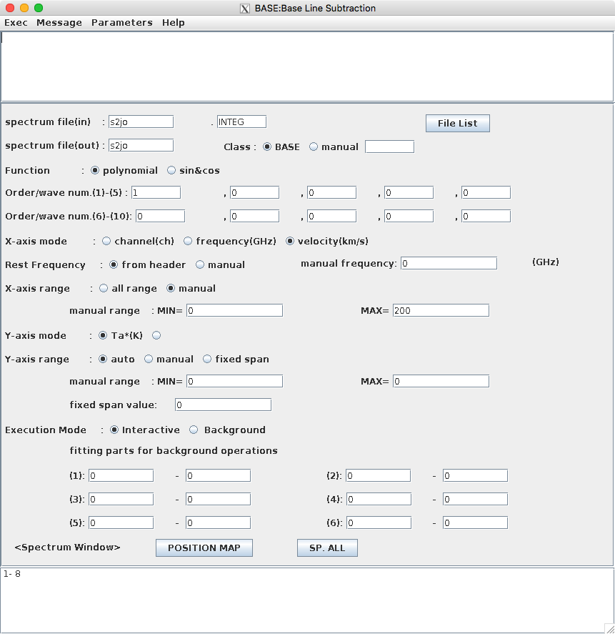
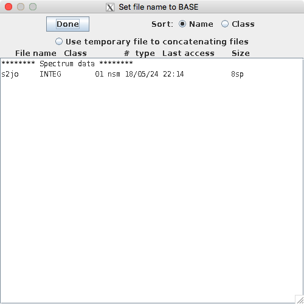
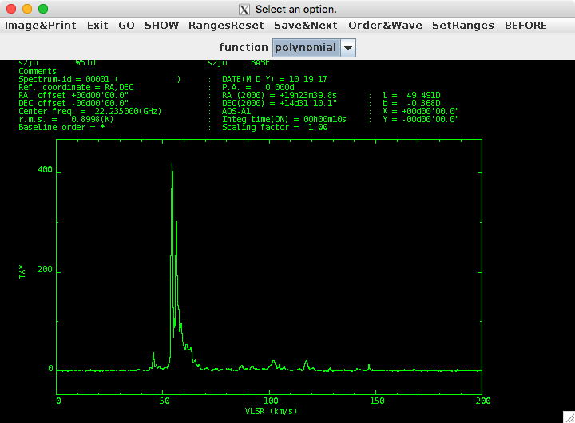
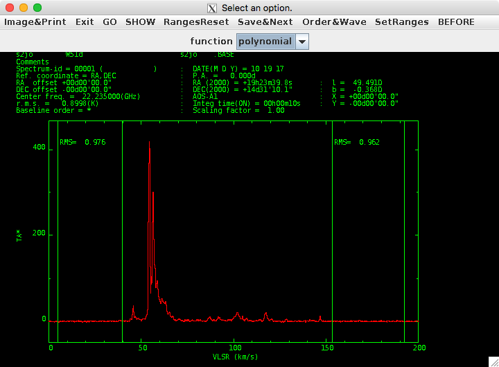

BASELINE
========

このタスクは、ベースラインを引くという処理を行います。実際に見た方が早いです。

BASELINEボタンを押すと下のようなウインドウが開きます。

File Listボタンを押すと下のようなウインドウが開きます。Large INTEGで作成したデータがリストにあると思いますので、選択して、Doneを押します。

最初のウインドウの説明に戻ります。

*spectral file(out)* : タスク実行後に出力する名前を入力します。最大8文字のようです。右側は拡張子を設定できますが、デフォルトのBASEがわかりやすいと思います。

*Function* : ベースラインフィッティングに使用する関数を選択します。最初は *polynomial* で良いでしょう。

*Order/wave num* : フィッティング関数の次数または波数を指定します。まずは最初の欄に1だけ入力して一次関数でフィッティングして良いでしょう。

*X-axis mode* から *Y-axis range* : この後、スペクトルを見ながらベースラインをしますが、その表示する軸や範囲を決めます。

*Execution Mode* : 実行方法を選択します。最初は *Interractive* でスペクトルを見ながら実行しましょう。

*<Spectrum Window>* : データに含まれるスペクトルのうち、このタスクを実行するスペクトルを選択できます。 *POSTION MAP* では観測座標を見ながら選択でき、 *SP. ALL* を押すと全スペクトルが選択されます。下の欄に\*が表示されていますが、これは全スペクトルを選択していることを示しており、このままでも良いです。もし特定のアレイに対してのみ行いたい場合は、ここに直接スペクトルのID番号を記入しても良いです。「1, 5」や「1-4」といった感じで選択できます。

パラメータ設定が完了したら、上部にあるメニューバーのExecを押し、Startを押すと実行されます。  *Interractive* モードの場合は、下のようなウインドウが表示されます。

下のような操作をすると下の画像のような結果になります。

 #. *SetRanges* を押し、フィッティングに使う範囲を選択する。下の場合は2回行い、2箇所選択している。
 #. *Go* を押し、フィッティングを行う。
 #. *SHOW* を押し、引いた結果を見る。

このデータは綺麗なデータでしたのであまり違いはないですが、輝線がないベースラインが0Kとなっていることを確認してください。これで問題がなければ、 *Save&Next* を押し、この結果を保存して次のスペクトルへ進みます。
