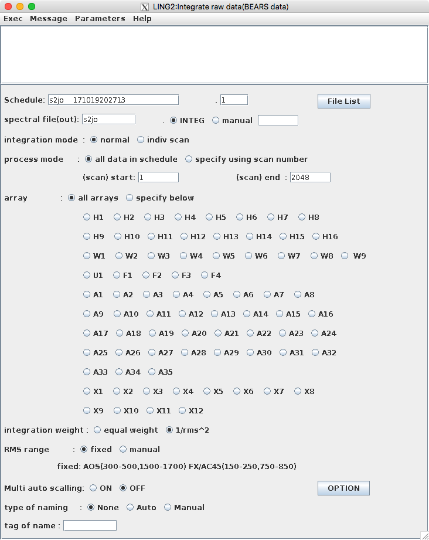

Large INTEG
===========

このタスクは、各アレイ毎に時間方向に積分するタスクです。観測では、例えば1点の観測を20秒積分して、OFF点を20秒積分して、という感じで繰り返していたと思います。生データはその20秒積分ずつのスペクトルに分かれていますので、このタスクで時間方向に積分し、各アレイにつき1スペクトルにします。

Large INTEGボタンを押すと下のようなウインドウが開きます。

File Listボタンを押すと下のようなウインドウが開きます。ここのリストに出てくるのは、 *.nqm* という拡張子の生データです。データをクリックすることで、上のウインドウの *Schedule* 欄にデータ名が入ります。また、観測で使用したSAM45分光計は各アレイ4096chを出力しますが、newstarは2048chしか扱うことができません。したがって、4096chを2048chにする方法を選択する必要があります。下の画像では、アレイの中心の2048ch分を抽出する1025-3072を選択しています。最後に *Done* で閉じます。

最初のウインドウの説明に戻ります。

*spectral file(out)* : タスク実行後に出力する名前を入力します。最大8文字のようです。右側は拡張子を設定できますが、デフォルトのINTEGがわかりやすいと思います。

*array* : タスクを実行するアレイを選択できます。もし特定のアレイのみ行いたい場合は、 *specify below* を選択して、下のアレイから選択してください。たくさんありますが、今回は最大でもA1-A16までしか使用していないと思いますので、その中から選んでください。複数選択することもできます。

*integration weight* : *1/rms^2* の方が良いと思います。

他のパラメータについては特に変更しないと思いますので説明は省略します。

パラメータ設定が完了したら、上部にあるメニューバーのExecを押し、Startを押すと実行されます。
