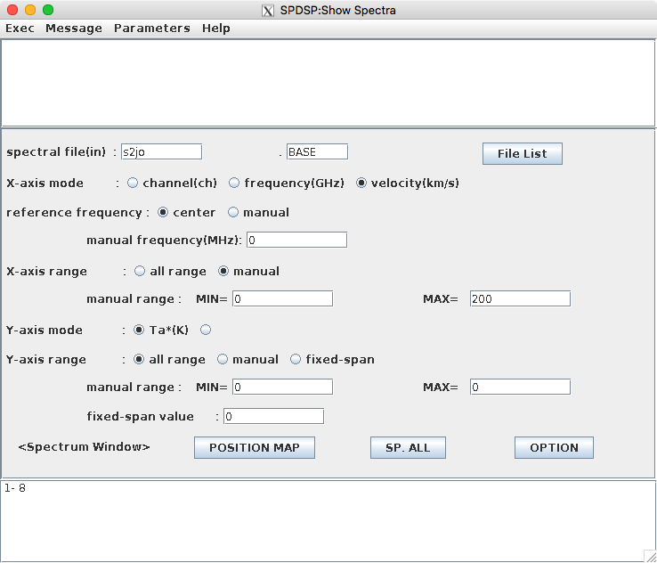
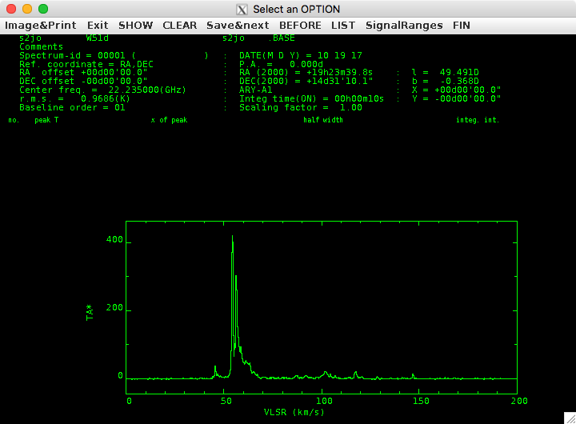

Show Spectra
============

このタスクは、スペクトル見るタスクです。Large INTEG後のデータでもBASELINE後のデータでもスペクトルを見ることができます。

Show Spectraボタンを押すと下のようなウインドウが開きます。

ここまで来ると特にパラメータの説明は必要ないでしょう。パラメータ設定後、Execを押して実行すると下のウインドウが表示されます。ここでは、例えば、 *SignalRanges* を押して輝線を囲むとその範囲のピーク強度、ピーク位置、線幅、積分強度を表示してくれます。

