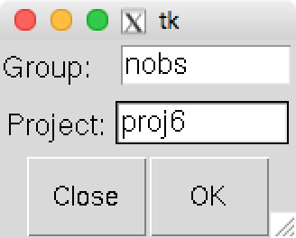
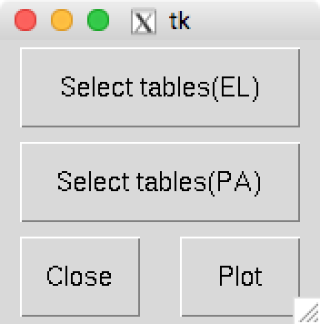
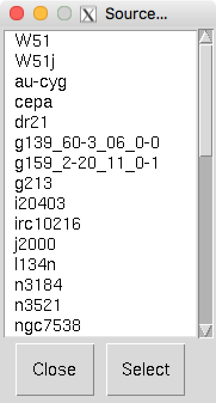
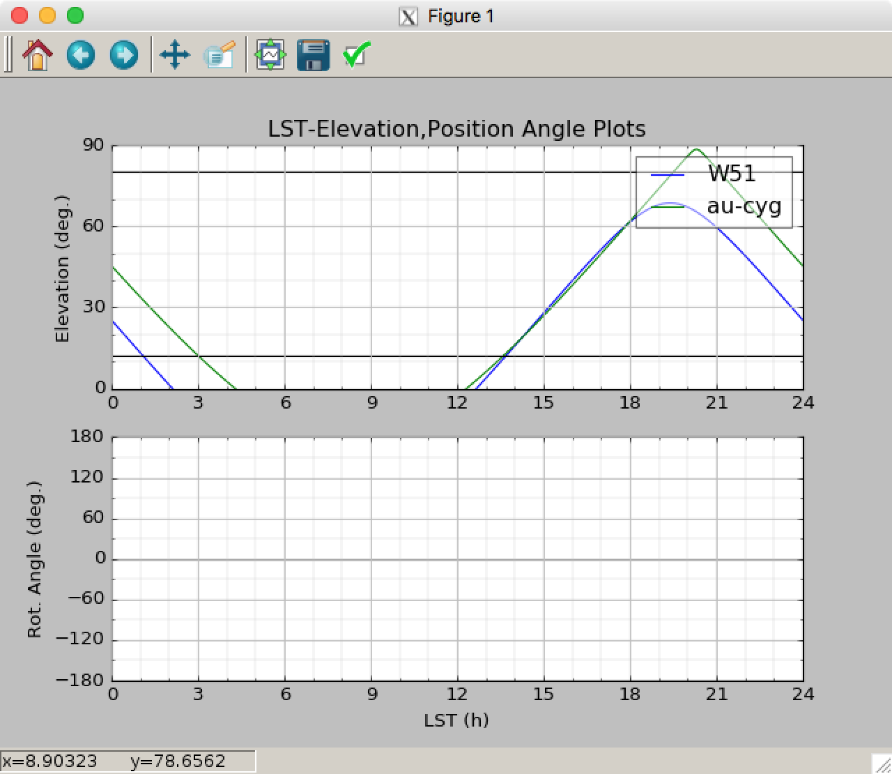

Mult PA
=======

このツールはLSTに対するElevationのプロットと受信機回転角のプロットを表示します。今回は受信機が回転するFORESTは使用しませんので、LST-ELプロットとしてのみ利用してください。また、 *nobs* の *Source* タブで作成した *.nsource* テーブルを使用しますので、先に作成しておく必要があります。

*ut12x1* で、下のコマンドを打つとウインドウが開きます。 ::

 $ multpa.py

*Group* , *Project* を入力して *OK* を押すと下のウインドウが新たに開きます。

*Select tables(EL)* を押すと下のウインドウが新たに開きます。ここには、 *.nsource* のリストが表示されます。

プロットしたい天体を選択します。選択された天体は背景がオレンジ色になり、複数選択することも可能です。 *Select* ボタンを押すとウインドウも閉じます。そして、1つ前のウインドウで、 *Plot* ボタンを押すと下のようにプロットが表示されます。

