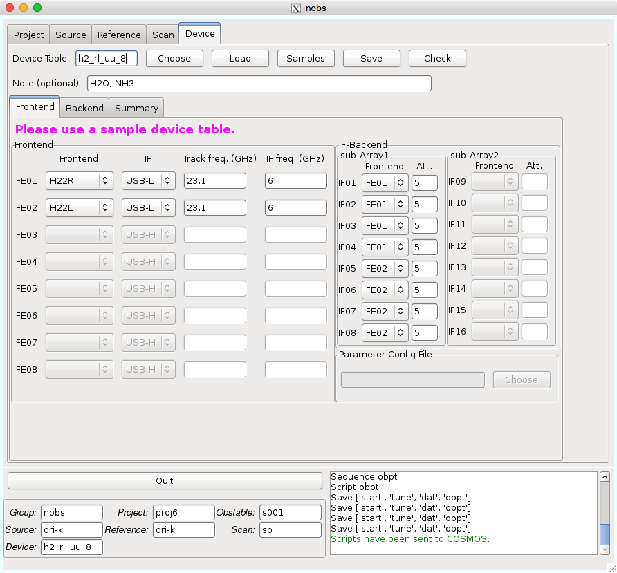

Device
======

Deviceタブでは、スキャンの方法を記載します。ここで作成されるテーブルは拡張子が *.ndevice* となります。

*Device Table* : このテーブルの名前が入ります。これまでに作成したテーブルがあれば *Choose* ボタンにより選択することができます。作成したテーブル名を入力して *Load* ボタンを押すと、そのテーブルがロードされます。 *Samples* には、各受信機、各パターンのサンプルがあり、観測毎に使用するパターンを最初に選択してください [*]_。 *Save* ボタンを押すことで保存できます。 *Check* は記入したパラメータに問題がないかをチェックし、 *Summary* タブに設定が出力されます。

.. note::
 このテーブル名は以下の制限があります。

  - 最大16文字
  - 最初の文字はアルファベットのみ可
  - 2文字目以降はアルファベット、数字、-、_のみ可
  - アルファベットは小文字のみ可

*Note (optional)* : このテーブルのメモなどにご利用ください。100文字まで書くことができます。

Deviceタブはさらに3つのダブに分かれています。

.. toctree::
   nobs_device_frontend
   nobs_device_backend
   nobs_device_summary

----

.. [*] Deviceの設定は複雑なため、観測時に問題が起きないようにある程度制限するためです。
