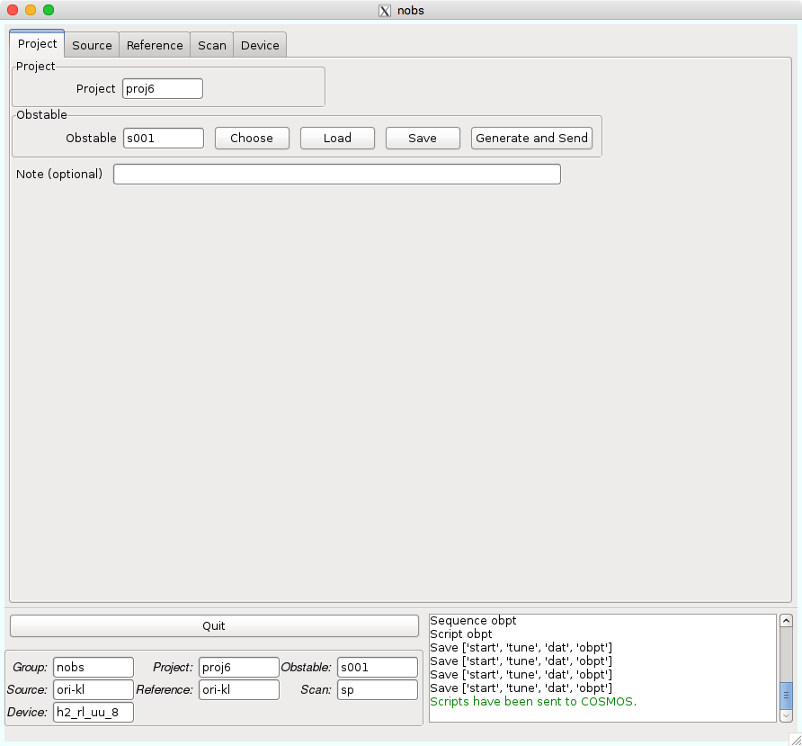

Project
=======

Projectタブでは、指示書の名前と指示書作成に使用するテーブルの構成を決定します。ここで作成されるテーブルは拡張子が *.nobserve* となります。また、これから作成するテーブル群は以下のディレクトリに作成されます。 ::

 /home/ACCOUNT/PROJECT/obstable/

*Project* : プロジェクトの名前を記入します。各アカウントに複数用意されており、用途によって使い分けたりしますが、今回はproj1のみ使用していれば問題ないでしょう [*]_。

*Obstable* : このテーブルの名前が入り、指示書の名前もこれと同じになります。これまでに作成したテーブルがあれば *Choose* ボタンにより選択することができます。作成したテーブル名を入力して *Load* ボタンを押すと、そのテーブルがロードされます。 *Save* ボタンを押すことで保存できます。 *Generate and Send* を押すことで、指示書が作成され、かつ、COSMOSが参照できる場所へ送られます。

.. note::
 各テーブル名やパラメータには使用できる文字や文字数が限定されます。このテーブル名は以下の制限があります。

  - 最大7文字
  - 最初の文字はアルファベットのみ可
  - 2文字目以降はアルファベット、数字、+、-のみ可
  - アルファベットは小文字のみ可

*Note (optional)* : このテーブルのメモなどにご利用ください。100文字まで書くことができます。

下側のパネルはどのタブでも表示されています。 *Quit* ボタンでnobsを終了します。その下にはGroup (アカウント)、Project、各テーブルの情報が記載されます。右側はメッセージボックスです。問題がある場合は赤色のメッセージが表示されます。

.. hint::
 指示書名や各テーブルの名前は制限が厳しくなっていますので、指示書作成を始める前にそれぞれの班で命名規則を決めた方が良いでしょう。指示書によって変わる可能性がある部分を列挙すると良いでしょう。例えば以下のようなことが考えられます。

  - ファイル検索がしやすいように最初の文字は用途で統一する(例えばポインティング観測用はpから始めるなど)
  - 複数の天体がある場合、各天体を1文字で表す
  - 複数の観測点がある場合、各点を数字またはアルファベットで表す
  - 複数のデバイス設定がある場合、各設定を1文字で表す
  - 拡張できるように最初は7文字目を使用しない

----

.. [*] 通常はproj1からproj5の5つが用意されています。proj6は特殊です。

