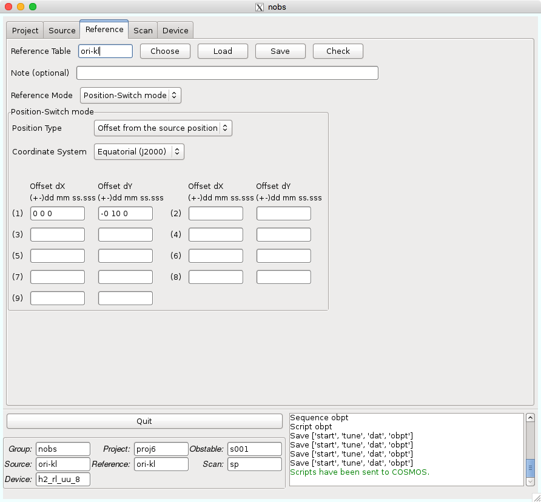

Reference
=========

Referenceタブでは、OFF点の情報を記載します。ここで作成されるテーブルは拡張子が *.nreference* となります。

*Reference Table* : このテーブルの名前が入ります。これまでに作成したテーブルがあれば *Choose* ボタンにより選択することができます。作成したテーブル名を入力して *Load* ボタンを押すと、そのテーブルがロードされます。 *Save* ボタンを押すことで保存できます。 *Check* は記入したパラメータに問題がないかをチェックします。

.. note::
 このテーブル名は以下の制限があります。

  - 最大16文字
  - 最初の文字はアルファベットのみ可
  - 2文字目以降はアルファベット、数字、-、_のみ可
  - アルファベットは小文字のみ可

*Note (optional)* : このテーブルのメモなどにご利用ください。100文字まで書くことができます。

*Reference Mode* : 現在は *Position-Switch mode* しか選択できません。

*Position Type* :  Sourceタブで記入した天体からのオフセットか絶対座標かを選択できます。

*Coordinate System* : 座標系を選択します。また、この選択により座標入力欄が変わりますので、入力欄上の例にならって座標を記入してください。

.. warning::
 SourceタブとReferenceタブで *Coordinate System* を揃える必要があります。
