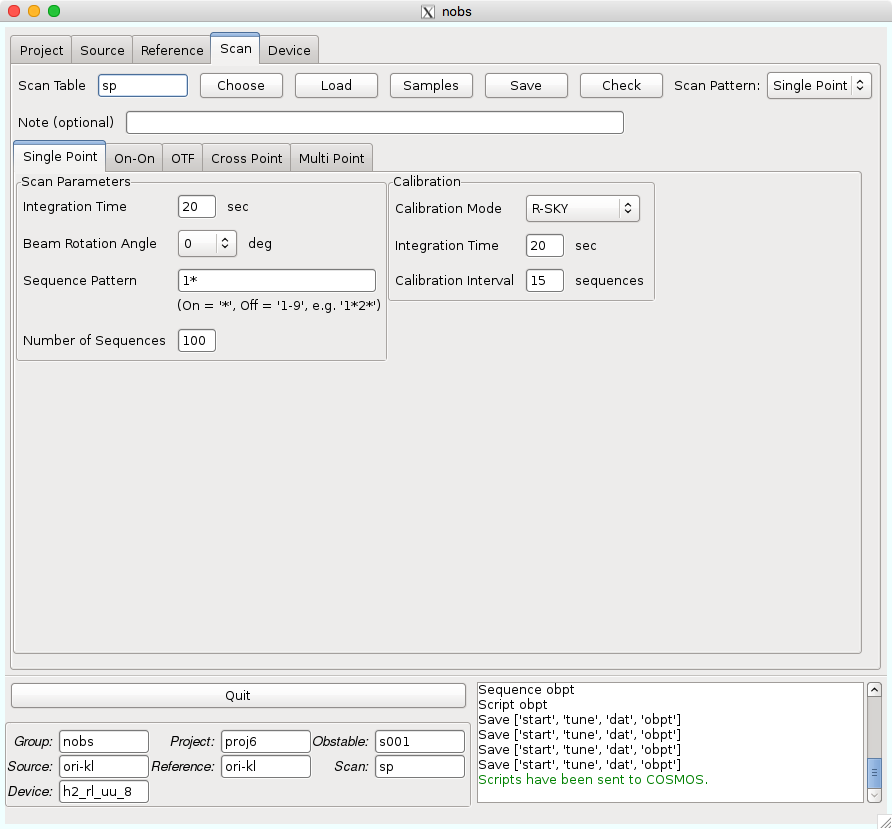

Scan
====

Scanタブでは、スキャンの方法を記載します。ここで作成されるテーブルは拡張子が *.nscan* となります。

*Scan Table* : このテーブルの名前が入ります。これまでに作成したテーブルがあれば *Choose* ボタンにより選択することができます。作成したテーブル名を入力して *Load* ボタンを押すと、そのテーブルがロードされます。 *Samples* には、よく使用されるサンプルがあり、選択するとパラメータが自動でセットされます。 *Save* ボタンを押すことで保存できます。 *Check* は記入したパラメータに問題がないかをチェックします。

.. note::
 このテーブル名は以下の制限があります。

  - 最大16文字
  - 最初の文字はアルファベットのみ可
  - 2文字目以降はアルファベット、数字、-、_のみ可
  - アルファベットは小文字のみ可

*Note (optional)* : このテーブルのメモなどにご利用ください。100文字まで書くことができます。

スキャン方法にはいくつか種類があります。今回使用する可能性のある3つを説明します。

.. toctree::
   nobs_scan_sp
   nobs_scan_cp
   nobs_scan_mp
