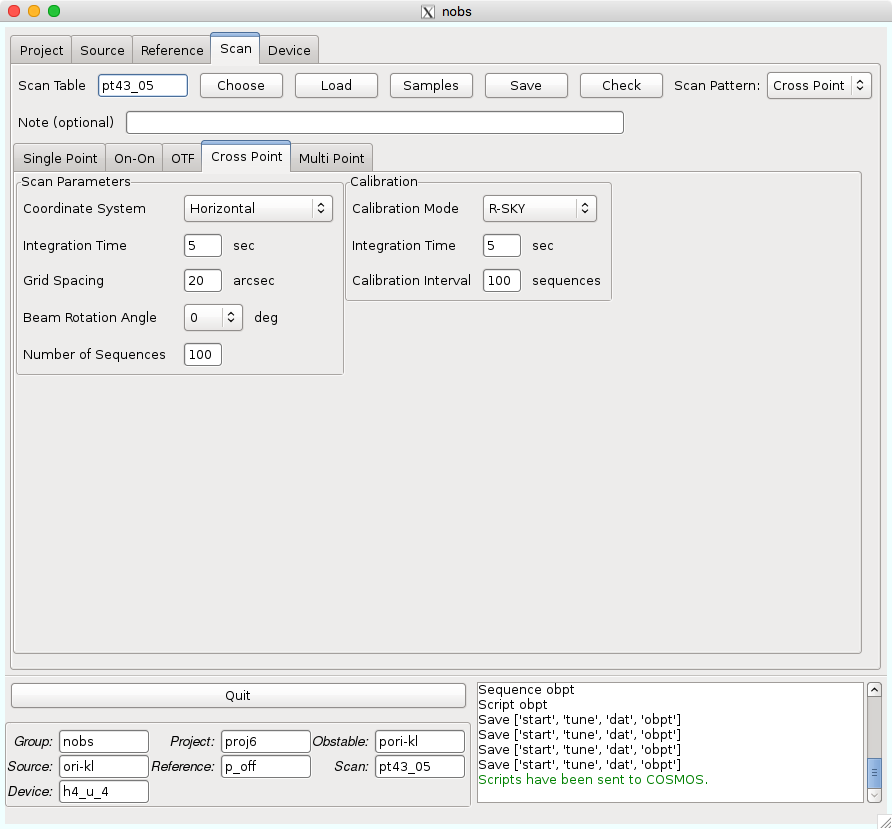

Cross Point
===========

Cross Pointは、Pointing観測で使用される方法であり、Sourceタブで指定した座標を中心に十字型に5点観測します。基本的には *Samples* にあるものをそのまま使用しますので、パラメータは特に変更しなくて大丈夫だと思います。

*Coordinate System* : Pointing時は通常 *Horizontal* です。

*Integration Time* : ON点の積分時間です。OFF点も同じ時間になります。

*Grid Spacing* : 各点の間隔です。通常ビームサイズの半分にします。

*Beam Rotation Angle* : 今回は使用しませんので、そのままで大丈夫です。

*Number of Sequence* : 上で記述したパターンを繰り返す数です。Cross Pointの場合は、観測状況により各自で観測を止めることが通常ですので、長めに設定しておけば良いです。ただし、ON, OFF, RSKYをそれぞれ1カウントとして、1000未満でなければなりません。

*Calibration Mode* : キャリブレーションモードの選択です。今回はR-SKYを使用します。

*Integration Time* : キャリブレーション時の積分時間です。Cross Pointの場合は、通常、ON点やOFF点と同じ時間にします。

*Calibration Interval* : キャリブレーションを行う頻度を指定します。Pointing観測では最初のみ行えば十分だと思います。
