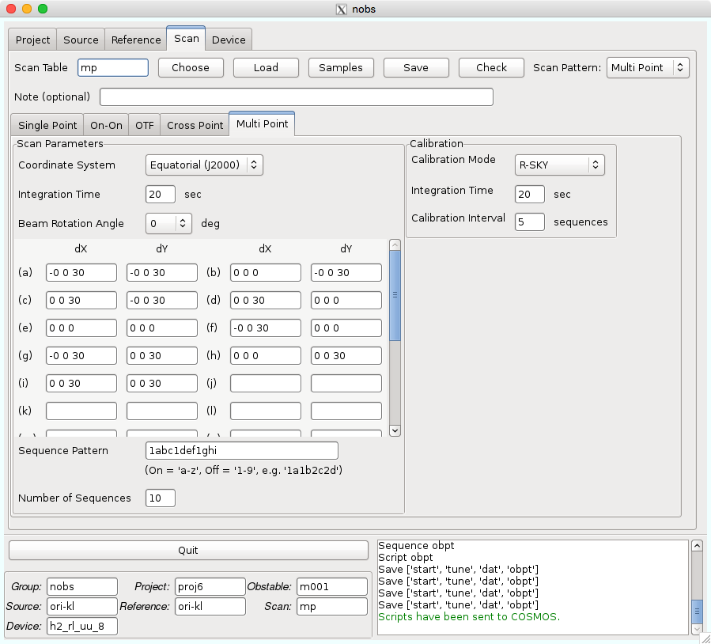

Multi Point
===========

Multi Pointは、ON点が複数ある場合に利用する方法です。ON点の座標はSourceタブで指定した座標に対するオフセットで記述します。

*Coordinate System* : 座標系を指定します。

*Integration Time* : ON点の積分時間です。OFF点も同じ時間になります。

*Beam Rotation Angle* : 今回は使用しませんので、そのままで大丈夫です。

*Sequence Pattern* : スキャン順序のパターンを決めます。数字はReferenceタブにおけるID番号、アルファベットはON点を示します。

*Number of Sequence* : 上で記述したパターンを繰り返す数です。Multi Pointの場合は、観測状況により各自で観測を止めることが通常ですので、長めに設定しておけば良いです。ただし、ON, OFF, RSKYをそれぞれ1カウントとして、1000未満でなければなりません。

*Calibration Mode* : キャリブレーションモードの選択です。今回はR-SKYを使用します。

*Integration Time* : キャリブレーション時の積分時間です。Multi Pointの場合は、通常、ON点やOFF点と同じ時間にします。

*Calibration Interval* : キャリブレーションを行う頻度を指定します。通常10分から15分間隔で行います。単位はsequenceです。

.. hint::
 画像のSequence PatternのようにOFF点とOFF点の間に3つの異なるON点を観測することで、時間短縮になります。利用する場合は各チューターとご相談ください。
