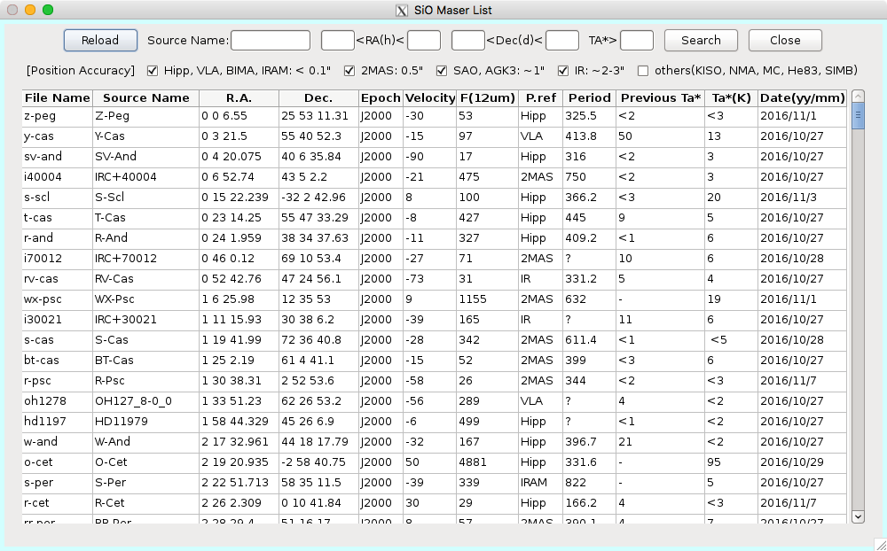

SiO Maser List
==============

*Source* タブにある *SiO Maser List* ボタンを押すと上のようなウインドウが開きます。これは、主にポインティング天体を探すときに利用されます。このリストから天体を探し、どの列でも良いので、クリックするとその行の天体の情報が *Source* タブに反映されます。また、上部の入力欄に数値を入れて *Search* ボタンを押すことで、条件にあった天体の検索もできます。

.. hint::
 | ポインティング天体はターゲット天体と近いほど良いです。そのため、まずは座標で絞り込みをすると良いです。
 | また、観測地点の緯度と天体の赤緯により天体の天球面での移動が北回りか南回りになります。これに関してもターゲット天体とポインティング天体を合わせた方が良いです。野辺山の緯度は約35度ですので、これを境に絞り込みましょう。
