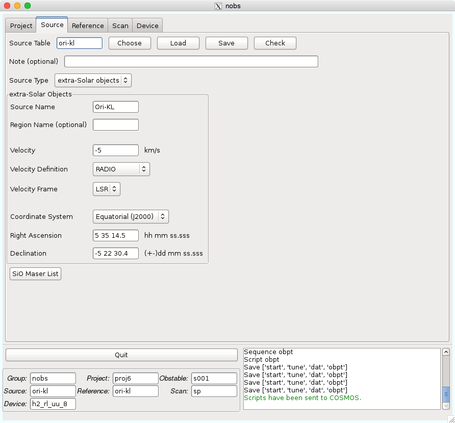

Source
======

Sourceタブでは、天体の情報を記載します。ここで作成されるテーブルは拡張子が *.nsource* となります。

*Source Table* : このテーブルの名前が入ります。これまでに作成したテーブルがあれば *Choose* ボタンにより選択することができます。作成したテーブル名を入力して *Load* ボタンを押すと、そのテーブルがロードされます。 *Save* ボタンを押すことで保存できます。 *Check* は記入したパラメータに問題がないかをチェックします。

.. note::
 このテーブル名は以下の制限があります。

  - 最大16文字
  - 最初の文字はアルファベットのみ可
  - 2文字目以降はアルファベット、数字、-、_のみ可
  - アルファベットは小文字のみ可

*Note (optional)* : このテーブルのメモなどにご利用ください。100文字まで書くことができます。

*Source Type* : 現在は *extra-Solar objects* しか選択できません。

*Source Name* : 天体名を記述します。ここには一般的な名前を入れてください [*]_。ここにも制約があり、最大15文字、最初の文字はアルファベット、2文字目以降はアルファベット、数字、-、_のみ可、となっています。

*Region Name (optional)* : 自分で区別したい名前があればご利用ください。16文字まで自由に書くことができます。

*Velocity* : 天体の速度です。この速度が分光帯域の中心となります。

*Velocity Definition* : 速度の定義を選択します。今回は *RADIO* で良いと思います。

*Velocity Frame* : 速度の基準です。現在は *LSR (Local Standard of Rest)* のみしか利用できません。

*Coordinate System* : 座標系を選択します。また、この選択により座標入力欄が変わりますので、入力欄右の例にならって座標を記入してください。

:doc:`nobs_sio_maser_list` : このボタンを押すことでSiO Maserのリストが表示されるウインドウが開きます。ポインティング観測に使用する天体を探すときに利用してください。

.. toctree::
   :hidden:

   nobs_sio_maser_list

----

.. [*]  *Source Name* が `アーカイブ <https://nobeyama-archive.nao.ac.jp/user/index.html>`_ に登録されるためです。
