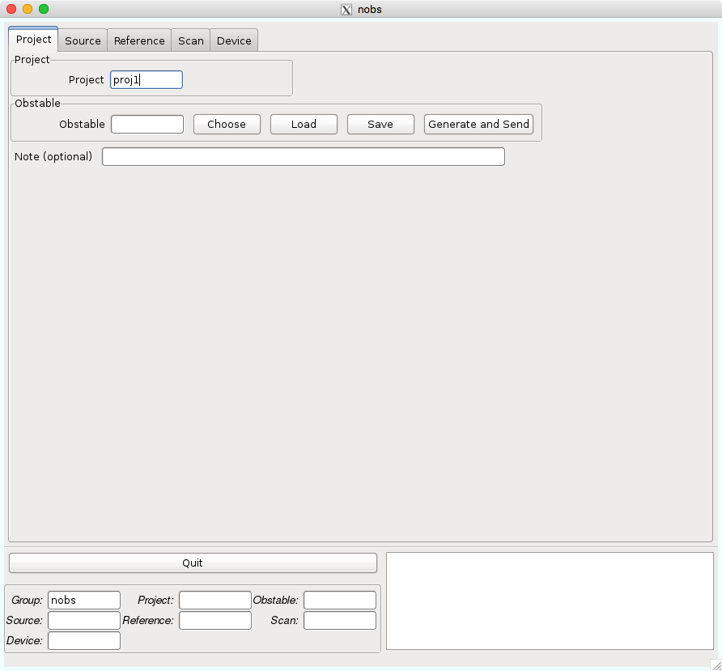

観測準備
========

はじめに
--------

45m電波望遠鏡はCOSMOSというソフトで制御しており、特別な命令文が必要です。1つの観測は、その特別な命令文を順番に行うことで実行でき、その1観測毎に命令文をまとめたものを **指示書** と言います。その指示書をCOSMOSに渡すことで観測ができます。観測者は指示書を作成するために *nobs* という指示書作成ソフトを利用します。

まずは、専用の計算機である *ut12x1* へログインします。観測所からは下のどちらかの方法でログインできます。 ::

 $ ssh -X ACCOUNT@ut12x1
 $ ssh -Xl ACCOUNT ut12x1

.. note::
 | ACCOUNTは各班に1つ配りますのでそれを入力してください。
 | Macの場合、オプションの-Xを-Yにする必要があります。

ut12x1へログインできたら、 *nobs* を起動します。 ::

 $ nobs

下のような画面が出てくるかと思います。

nobsの説明
----------

1つの指示書は複数のテーブルを複合して作成され、各テーブル毎にタブで分けています。

.. toctree::
 nobs_project
 nobs_source
 nobs_reference
 nobs_scan
 nobs_device

.. tip::
 | nobs上での操作に関してです。
 | Macの場合ですが、control + aで全選択、control + cでコピー、control + vで貼り付けとなります。

ツール
------

観測準備で役立つツールを紹介します。

.. toctree::
 multpa
 obspoint

