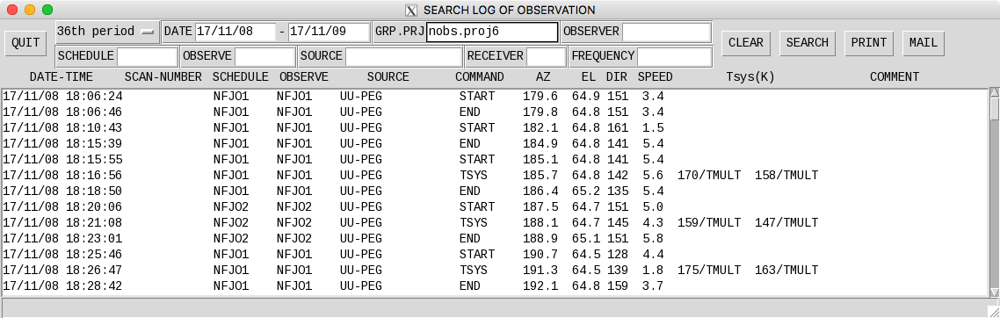
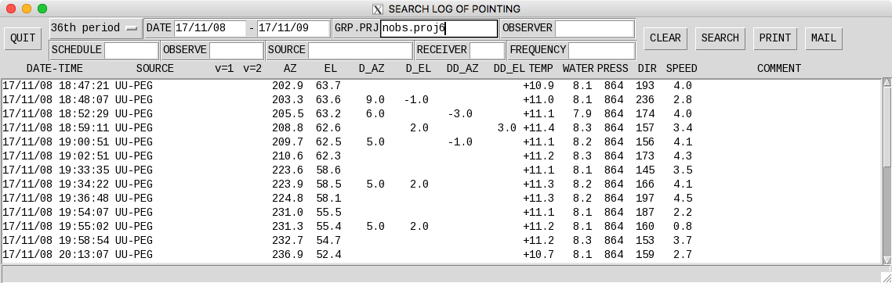

Log of observations
===================

観測棟で自動ログを取得できますが、もし取得し忘れたり、過去のログが欲しい場合は、ut12x1でいつでも取得可能です。

Observing log
-------------

ut12x1へログイン後、下のコマンドで下のようなウインドウが開きます。 ::

 $ also

*DATE* と *GRP.PRJ* を入力し、 *SEARCH* ボタンを押すことで表示されます。テキストデータが欲しい場合は、 *MAIL* ボタンを押して自分のメールアドレスを入力してください。

Pointing log
------------

ut12x1へログイン後、下のコマンドで下のようなウインドウが開きます。 ::

 $ alsp

*DATE* と *GRP.PRJ* を入力し、 *SEARCH* ボタンを押すことで表示されます。テキストデータが欲しい場合は、 *MAIL* ボタンを押して自分のメールアドレスを入力してください。
