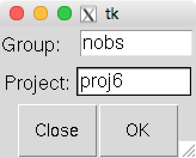
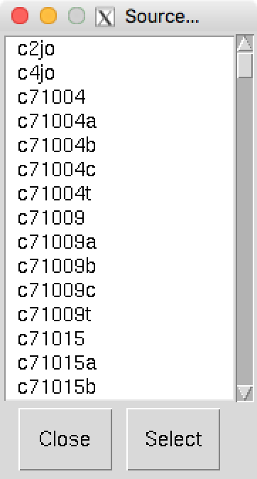
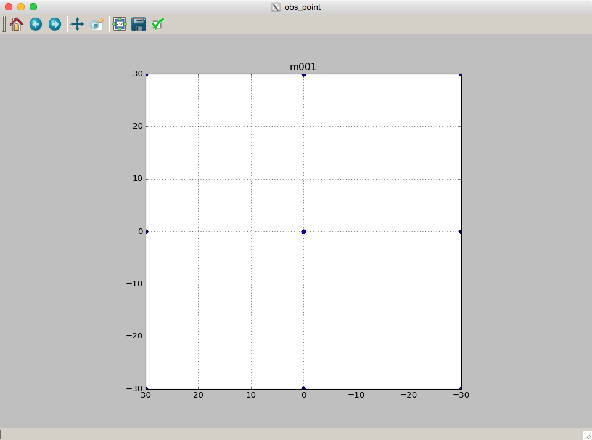

Obspoint
========

このツールは作成した指示書が意図する観測点になっているかを確認するためのツールです。 *nobs* で *Generate and Send* を実行すると作成される *.obpt* ファイルが必要ですので、先に作成しておく必要があります。

*ut12x1* で、下のコマンドを打つとウインドウが開きます。 ::

 $ obspoint.py

*Group* , *Project* を入力して *OK* を押すと下のウインドウが新たに開きます。

プロットを表示したい指示書名を選択します。 *Select* ボタンを押すと下のようにプロットが表示されます。 (ここでは、:doc:`nobs_scan_mp` で作成した指示書を表示しています。)

