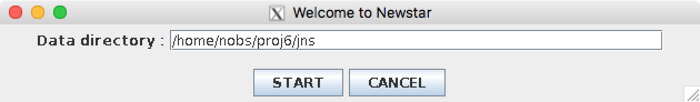
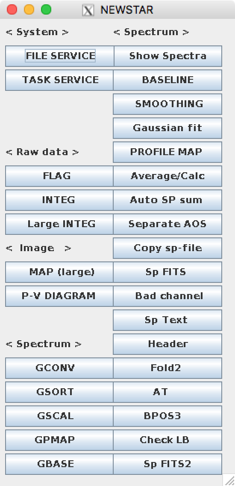

データリダクション
==================

はじめに
--------

観測で取得したデータはそのままでは研究に使えません。信号データを処理して有意なデータにする必要があります。これをデータリダクションまたはデータ整約と言います。ここでは、リダクションソフトとしてJAVA版の *NEWSTAR* を説明します。

まずは、専用の計算機である *vc06x1* へログインします。観測所からは下のどちらかの方法でログインできます。 ::

 $ ssh -X ACCOUNT@vc06x1
 $ ssh -Xl ACCOUNT vc06x1

vc06x1へログインできたら、最初はディレクトリを作成しましょう。観測時と同じプロジェクトディレクトリの下にjnsというディレクトリを作成します。 ::

 $ mkdir ~/proj1/jns

| 生データ [*]_ をダウンロードします。ダウンロード方法は下の2通りあります。方法は下のリンク先を参照してください。
| `ダウンロード方法 <http://vc01x1.nro.nao.ac.jp/~nrocomp/wiki/info01/index.php?データダウンロード>`_

 #. Webでのダウンロード
 #. コマンドラインでのダウンロード

データをダウンロードすることができたら、データを~/proj1/jns/に置いて、 *jnewstar* を起動します。 ::

 $ jnewstar

下のような画面が出てきますので、データディレクトリを指定して、 *START* ボタンを押します。

下のような画面が出てくるかと思います。

jnewstarの説明
--------------

各タスクの説明は下のリンク先で行いますが、最も単純なリダクションの流れは以下の通りです。

 #. Large INTEG: アレイ毎に全時間を積分する。
 #. BASELINE: ベースラインを引く。
 #. Show Spectra: リダクションされたスペクトルを見る。

.. toctree::
 jns_file_service
 jns_linteg
 jns_baseline
 jns_show_spectra
 jns_atsum
 jns_map

.. hint::
 指示書作成時と同様に各タスクの出力ファイルにも文字数制限などがありますので命名規則を決めておくと良いと思います。

----

.. [*] ダウンロードするデータはすでに色々処理されていますが、観測者にとっては最初のデータになりますので、生データと呼ぶことが多いです。
